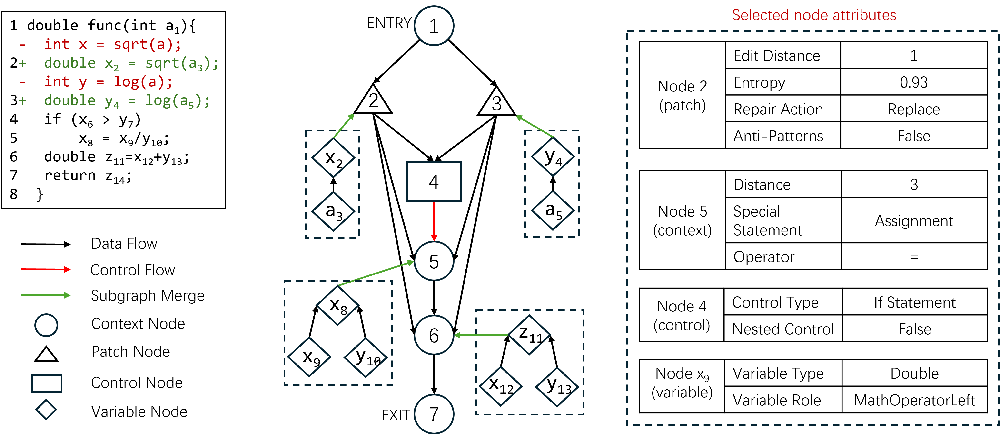
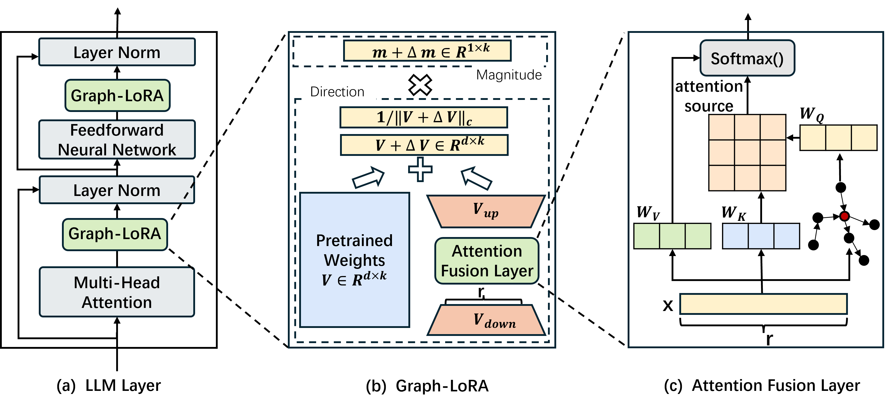

# Graph-LoRA
A PyTorch Implementation of paper "Parameter-Efficient Fine-Tuning with Attributed Patch Semantic Graph for Automated Patch Correctness Assessment". 
## Introduction
Automated program repair (APR) aims to automatically repair program errors without human intervention, and recent years have witnessed a growing interest on this research topic. While much progress has been made and techniques originating from different disciplines have been proposed, APR techniques generally suffer from the patch overfitting issue, i.e., the generated patches are not genuinely correct despite they pass the employed tests. To alleviate this issue, many research efforts have been devoted for automated patch correctness assessment (APCA). In particular, with the emergence of large language model (LLM) technology, researchers have employed LLM to assess the patch correctness and have obtained the state-of-the-art performance. The literature on APCA has demonstrated the importance of capturing patch semantic and explicitly considering certain code attributes in predicting patch correctness. However, existing LLM-based methods typically treat code as token sequences and ignore the inherent formal structure for code, making it difficult to capture the deep patch semantics. Moreover, these LLM-based methods also do not explicitly account for enough code attributes. To overcome these drawbacks, we in this paper design a novel patch graph representation named attributed patch semantic graph (APSG), which adequately captures the patch semantic and explicitly reflects important patch attributes. To effectively use graph information in APSG, we accordingly propose a new parameter-efficient fine-tuning (PEFT) method of LLMs named Graph-LoRA.



## Folder Structure
Here we list the descriptions of the folders:

```
 ├── APSG: the code for APSG
     ├──APSG/apsg: the code for extracting semantic information from patches
     ├──APSG/apsg_patch: the code for reading patches data and building APSG 
 ├── graph_lora: the code for Graph_LoRA
     ├──peft/data/: the code for data processing
     ├──peft/model/: the code for Graph-LoRA
 ├── ablation_study: the code for ablation studies
 ├── ground-truth: the code for training and testing model with ground-truth prompt
 ├── train.py: the code for training
 ├── test.py: the code for testing
```
## Requirements
* Conda
  * install conda: [https://conda.io/projects/conda/en/latest/user-guide/install/index.html](https://conda.io/projects/conda/en/latest/user-guide/install/index.html)
  * Create a new conda environment:
      * if you are running with GPU: 
        ```
        conda env create -f environment-gpu.yml
        conda activate graphlora
        ```
        Dependencies include support for CUDA_11.4. If you are using a different CUDA version update the dependencies accordingly.
      * if you are running with CPU:   
        ```
        conda env create -f environment-cpu.yml
        conda activate graphlora
## Dataset
* Wang dataset can be obtained from：https://zenodo.org/record/3730599/files/Patches_for_Static.zip
* Merge dataset can be obtained from：https://github.com/claudeyj/patch_correctness
* Balance dataset can be obtained from：https://github.com/claudeyj/patch_correctness/tree/master/balanced_dataset
* Lin dataset can be obtained from：https://github.com/Ringbo/Cache/tree/master/patches/Small
* Multi-Benchmarks dataset: This dataset is a large APCA dataset that contains patches for three bug benchmarks: Defects4J, Bugs.jar, and Bears. The construction process of the Multi-Benchmarks dataset is as follows:
  (1) First, we add data from the Lin and Merge datasets to the Multi-Benchmarks dataset.
  (2) Then, to avoid an excessive number of overfitting patches for Defects4J, we add human-written patches for Defects4J as the correct patches to the Multi-Benchmarks dataset.
  (3) Next, to supplement the patches for bug benchmarks besides Defects4J, we augment the Multi-Benchmarks dataset with the patches for bug benchmarks Bugs.jar and Bears released by Ye et al.
  (4) Finally, after deduplication, Multi-Benchmarks contains 7794 patches, including 2673 correct patches and 5121 overfitting patches. The Multi-Benchmarks dataset can be obtained from: https://drive.google.com/file/d/1tbz-nHe4MTAoI8H-5vE5TJjQDH_FgyI8/view?usp=sharing

## Dependency
* Python >= 3.8
* Pytorch >= 1.5.0
* Transformers>=4.10.0
* Deepspeed
* Numpy
* Scikit-learn

## Preprocess
During the data preprocessing stage, we obtain the APSG of all patches.
### Obtaining the APSG
```
python3 APSG/apsg_patch.py --input input.jsonl --output output.jsonl --model-path /path/of/LLM --device auto
```

## Experiment
Our evaluation is performed on an Ubuntu 22.04.5 server equipped with two RTX A6000 GPUs.
### RQ1 (Model Effectiveness)
We train and test our model on five datasets: Wang dataset, Merge dataset, Balance dataset, Lin dataset and Multi-Benchmarks dataset.
We first train the model.
```
CUDA_VISIBLE_DEVICES=0,1 python train.py   --model_id /path/of/LLM   --train_json /path/of/train/data   --val_json   /path/of/test/data   --max_len 1024 --micro_batch_size 2 --global_batch_size 2   --epochs 1 --lr 2e-4 --warmup_ratio 0.06   --rank 256 --target all   --output_dir result_nocompile_nofa
```
Then we test the model.
```
python test.py --model_id /path/to/LLM --ckpt_dir ./result --test_json /path/test.json --micro_batch_size 2 --num_workers 4 --pin_memory

```
### RQ2 （Ablation Study）
We designed two ablation studies. (1) The first ablation study focuses on the model structure to demonstrate the contribution of the submodules in the model. (2) The second ablation study focuses on APSG nodes to demonstrate the contribution of different types of nodes in APSG.

In the first ablation study, five submodules are gradually removed: (1) Graph-LoRA-Attention, (2) Graph-LoRA-Weak, (3) APSG-Attribute, (4) APSG-Graph, and (5) LLM-Train.

(1)Graph-LoRA-Attention: We removed the attention fusion layer of Graph-LoRA and replaced it with Graph-LoRA-Attention which achieves fusion through vector concatenation. 
```
CUDA_VISIBLE_DEVICES=0,1 python /ablation_study/Graph_LoRA_ablation/Graph_LoRA-Attention/train.py   --model_id /path/of/LLM   --train_json /path/of/train/data   --val_json   /path/of/test/data   --max_len 1024 --micro_batch_size 2 --global_batch_size 2   --epochs 1 --lr 2e-4 --warmup_ratio 0.06   --rank 256 --target all   --output_dir result_nocompile_nofa

```
(2)Graph-LoRA-Weak: We remove GNN and directly input the linearized APSG content into the LLMs. 
```
CUDA_VISIBLE_DEVICES=0,1 python /ablation_study/Graph_LoRA_ablation/Graph_LoRA-Week/train.py   --model_id /path/of/LLM   --train_json /path/of/train/data   --val_json   /path/of/test/data   --max_len 1024 --micro_batch_size 2 --global_batch_size 2   --epochs 1 --lr 2e-4 --warmup_ratio 0.06   --rank 256 --target all   --output_dir result_nocompile_nofa

```
(3)APSG-Attribute: We delete the attributes of APSG and only input the graph structure of APSG and code patches into the LLMs.
First, we regenerate the APSG without attributes for the patches.
```
python3 ablate_structure_only_jsonl.py --input graphs.jsonl --output graphs_structure_only.jsonl
```
Then train the model.
```
CUDA_VISIBLE_DEVICES=0,1 python /ablation_study/Graph_LoRA_ablation/APSG-Atteibute/train.py   --model_id /path/of/LLM   --train_json /path/of/train/data   --val_json   /path/of/test/data   --max_len 1024 --micro_batch_size 2 --global_batch_size 2   --epochs 1 --lr 2e-4 --warmup_ratio 0.06   --rank 256 --target all   --output_dir result_nocompile_nofa

```
(4)APSG-Graph: We remove the whole APSG and only input the code patches into the LLMs.
```
CUDA_VISIBLE_DEVICES=0,1 python /ablation_study/Graph_LoRA_ablation/APSG-Graph/train.py   --model_id /path/of/LLM   --train_json /path/of/train/data   --val_json   /path/of/test/data   --max_len 1024 --micro_batch_size 2 --global_batch_size 2   --epochs 1 --lr 2e-4 --warmup_ratio 0.06   --rank 256 --target all   --output_dir result_nocompile_nofa
```
(5)LLM-Train: We do not train the model and only give LLMs the prompt and code patches.
```
CUDA_VISIBLE_DEVICES=0,1 python /ablation_study/Graph_LoRA_ablation/Original-LLM.py --input input.jsonl --output output.jsonl --model_name LLM_name --model_path /path/of/LLM
```
In the second ablation study, three types of nodes are gradually removed: (1) variable nodes, (2) control nodes, (3) context nodes.


(1) We first remove all variable nodes. 
```
python3 /ablation_study/APSG_ablation/APSG_vairablenode/apsg_patch.py --input input.jsonl --output output.jsonl --model-path /path/of/LLM --device auto
```
(2) Next, we remove the control nodes, preserving the data flow information.
```
python3 /ablation_study/APSG_ablation/APSG_controlnode/apsg_patch.py --input input.jsonl --output output.jsonl --model-path /path/of/LLM --device auto
```
(3) We finally remove the context nodes, retaining only the patch nodes and their additional information.
```
python3 /ablation_study/APSG_ablation/APSG_contextnode/apsg_patch.py --input input.jsonl --output output.jsonl --model-path /path/of/LLM --device auto
```
### RQ3 (Cross-project Effectiveness)
First, generate a cross-project dataset.
```
python cross-project.py
```
Second, train and test the model on cross-project dataset.
```
CUDA_VISIBLE_DEVICES=0,1 python train.py   --model_id /path/of/LLM   --train_json /path/of/train/data   --val_json   /path/of/test/data   --max_len 1024 --micro_batch_size 2 --global_batch_size 2   --epochs 1 --lr 2e-4 --warmup_ratio 0.06   --rank 256 --target all   --output_dir result_nocompile_nofa
```
```
python test.py --model_id /path/to/LLM --ckpt_dir ./result --test_json /path/test.json --micro_batch_size 2 --num_workers 4 --pin_memory
```

### Effect of Ground-Truth Patches

To investigate the effect of ground-truth patches on the model performance, we use them as prompt inputs to the model and conduct experiments on the Lin dataset and the Balance dataset.

We collect Defects4J human-written patches as ground-truth patches and construct a patch pair for each to be assessed, consisting of the patch itself and the ground-truth patch for the corresponding bug.

The command to construct patch pair is as follows.
```
python groundtruth.py --root_dir /path/of/dataset --output groundtruth.json --human_root /path/of/humanwrite/patch
```
We place the ground-truth patch in the patch pair preceding the patch to be assessed as prompt to feed into the model.

We train and test model with ground-truth patch as follows.
```
CUDA_VISIBLE_DEVICES=0,1 python /ground_truth/train_gt.py   --model_id /path/of/LLM   --train_json /path/of/train/data   --val_json   /path/of/test/data   --max_len 1024 --micro_batch_size 2 --global_batch_size 2   --epochs 1 --lr 2e-4 --warmup_ratio 0.06   --rank 256 --target all   --output_dir result_nocompile_nofa
```
```
python /ground_truth/test_gt.py --model_id /path/to/LLM --ckpt_dir ./result --test_json /path/test.json --micro_batch_size 2 --num_workers 4 --pin_memory
```
